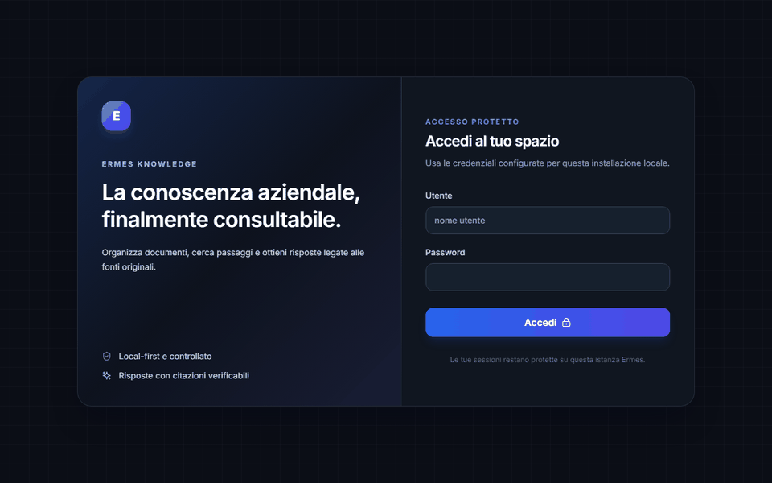
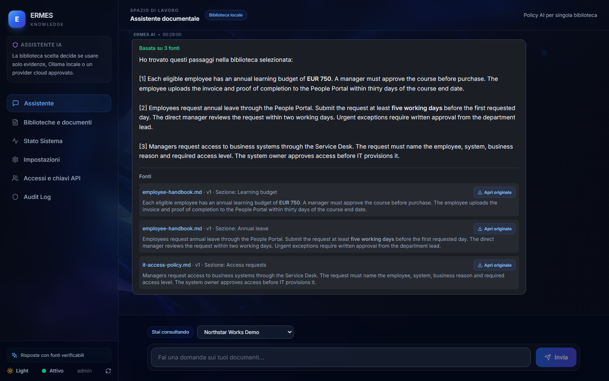
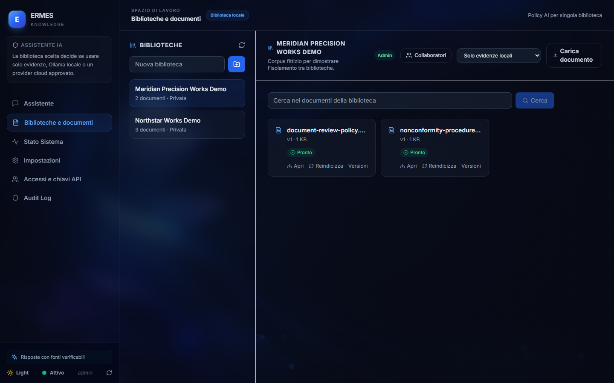
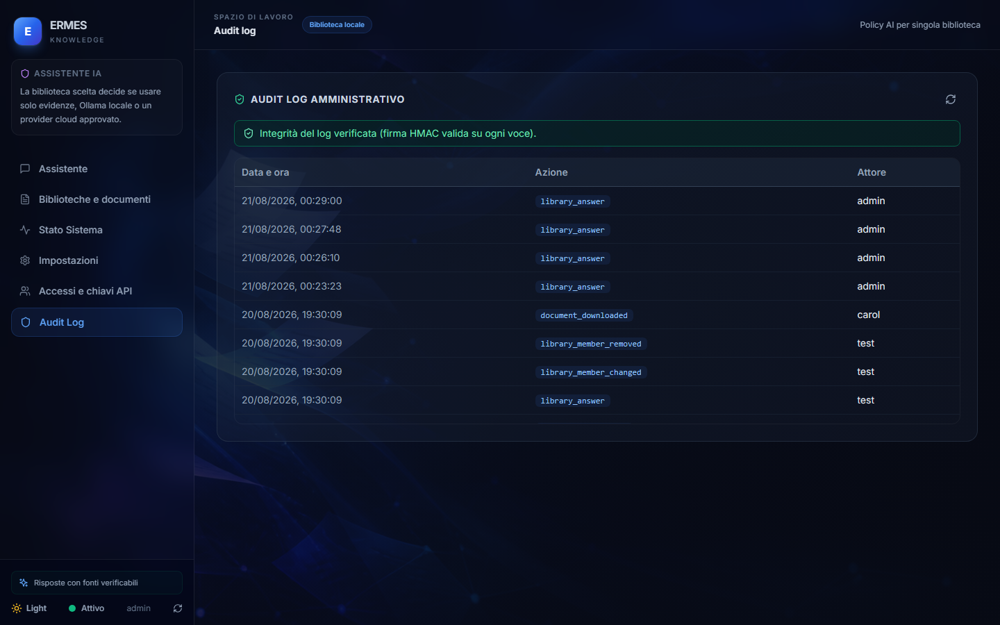

# Ermes Knowledge

Ermes Knowledge is a local-first document library for small and medium businesses. It turns company files into a governed, searchable knowledge base: users upload documents, ask questions in natural language, and receive answers that point back to the supporting source.

The product is designed to be useful before any cloud AI is enabled. Its default mode is evidence-only: documents remain local and the application returns the most relevant passages with traceable citations. An administrator may explicitly enable a local Ollama model or an approved OpenRouter provider for a single library.

> Status: active MVP / portfolio project. The current implementation is single-tenant and local-first; it is not yet a complete enterprise SaaS platform.



*The full sequence from [docs/DEMO_GUIDE.md](docs/DEMO_GUIDE.md), recorded end-to-end against a running instance: two answered questions with real citations, then two correct abstentions — the second one proving retrieval never crosses a library boundary, not just asserting it.*



*Every substantive answer names its sources: file, version, section and the exact excerpt it relied on — and the original document is one click away. When the library cannot support an answer, the assistant says so instead of inventing one.*

## Why it exists

Teams often have procedures, policies, manuals, contracts and internal know-how spread across folders. Finding the right version is slow and unreliable. Ermes Knowledge provides one controlled entry point where the answer is tied to the source document instead of presented as unexplained AI output.

## Current capabilities

- Separate libraries with private or shared visibility.
- Upload, parse and index PDF, DOCX, TXT, Markdown, XLSX, PPTX, CSV and RTF documents — with per-cell and per-slide locators for precise citations.
- Version history, restore and protected download of original files.
- Chunk-level retrieval scoped to the selected library, hybrid (full-text + embeddings). A neural cross-encoder reranker is implemented and available, but **off by default**: measured on the project's own gold set it makes every configuration worse (recall@3 0.815 vs 0.852, paraphrases 0.375 vs 0.500). The comparison that decided it is reproducible with `python evaluation/run_library_eval.py --compare` — see [docs/RETRIEVAL_EVALUATION.md](docs/RETRIEVAL_EVALUATION.md).
- Per-user semantic search cache (TTL + LRU) with automatic invalidation on writes — scoped per user so ACL boundaries are never cached across.
- Evidence-first answers with citations, document version, locator and excerpt.
- Clear abstention when the selected library does not contain enough evidence.
- Optional evidence verification: a model is asked whether each retrieved passage actually answers the question, and passages that do not are dropped before the answer is composed. It is the only mechanism measured that improves paraphrased questions **without** destroying abstention — recall@3 0.889 with abstention still at 1.000, against 0.852 for the shipped default. Off by default because it costs a model call per candidate passage; see [docs/RETRIEVAL_EVALUATION.md](docs/RETRIEVAL_EVALUATION.md) for the four score-based signals that were measured first and did not work.
- OIDC/SSO group-to-library ACL propagation: mapped groups grant viewer/editor roles (never admin), direct memberships always win, and SSO-only reachable libraries appear in the user's list.
- Dual database backend: SQLite by default, PostgreSQL via `ERMES_DATABASE_URL` (psycopg 3, jsonb embeddings, tsvector full-text, `SKIP LOCKED` job claims) — see [docs/POSTGRES_MIGRATION_PLAN.md](docs/POSTGRES_MIGRATION_PLAN.md).
- Prometheus metrics at `/metrics` (auth required): request latency, RAG questions, rerank mode, ingestion outcomes.
- Enterprise Connectors: Local NAS / Network Shared Folders (`local_folder`), Web Scraper, and Microsoft Graph (SharePoint / OneDrive) — all configurable from the React UI, with a folder-watcher status bar and one-click sync.
- Model Context Protocol (MCP) Server: native JSON-RPC 2.0 (`/api/mcp/rpc`) and REST (`/api/mcp/tools`) for AI agents (Claude Desktop, Cursor, Antigravity, LangChain).
- Automation Webhook Gateway: API Key-authenticated REST endpoints (`/api/integrations/automation/ask` and `/ingest`) tailored for n8n, Zapier, Make, and microservices.
- Multi-channel Chat Integrations: Slack Slash Commands / Events, Microsoft Teams Outgoing Webhooks, and Telegram Bot API.
- Dedicated React Interface with first-access onboarding wizard, Connectors & Automations tab, FastAPI backend, automated test suite (backend `pytest`, frontend `vitest`, Locust load scenarios, pytest performance benchmarks).



*Each library is a separate boundary: its own documents, its own collaborators, and its own assistant policy. Retrieval is constrained to the selected library before any context reaches the assistant — the demo corpus ships with a check that proves it, rather than asserting it.*

## Product principles

1. **Local first.** A cloud API key alone never enables cloud processing.
2. **Evidence before generation.** Every substantive answer must cite an accessible document or abstain.
3. **Library isolation.** Retrieval is constrained to the chosen library before context reaches the assistant.
4. **Documents are untrusted data.** Retrieved text cannot authorize tools or actions.
5. **Originals and versions matter.** Citations remain linked to the document version that supported the answer.



*Library operations are recorded in an append-only audit log, each entry signed with HMAC. The interface verifies every signature and reports tampering rather than assuming the record is intact. Each installation generates and keeps its own signing key on first run — earlier versions shipped a default key that was committed to this repository, which made the signature forgeable by anyone holding a copy (see [threat model, T6](docs/THREAT_MODEL.md)). Set `ERMES_AUDIT_SECRET` yourself only when several instances must verify the same entries.*

## Quick start (Windows)

Prerequisites: Python 3.11+, Node.js 18+ and npm. Ollama is optional unless you select `local_ollama` or local semantic search.

```powershell
Copy-Item .env.example .env
py -3.11 -m venv .venv-ermes
.\.venv-ermes\Scripts\Activate.ps1
pip install -r requirements.txt
npm.cmd --prefix frontend install
.\.venv-ermes\Scripts\python.exe scripts\provision_local_demo_auth.py --write
.\scripts\avvia_ermes.ps1
```

Open [http://127.0.0.1:3000](http://127.0.0.1:3000). The API health endpoint is [http://127.0.0.1:8502/health](http://127.0.0.1:8502/health).

To check a configuration before starting anything — useful when deploying
somewhere new, or in a CI gate:

```powershell
.\.venv-ermes\Scripts\python.exe -m config.validation
```

It prints each problem with the variable to set and what to do about it, and
exits non-zero if any of them would make the application unusable. The same
check runs at startup: a configuration that cannot serve requests stops the
application rather than turning into scattered runtime errors. That mattered in
practice — with SSO enabled but no issuer or JWKS the application used to start
happily and answer `200` on `/health` while every single login was already
guaranteed to fail.

The project desktop shortcut, if created with `scripts/CREA_COLLEGAMENTO_DESKTOP.ps1`, launches the same official script.
The provisioning command is opt-in and writes first-run credentials only to untracked `.env` and `LOCAL_LOGIN.txt` files.

### Run checks

```powershell
.\.venv-ermes\Scripts\python.exe -m pytest -q tests/
npm.cmd --prefix frontend test -- --run
npm.cmd --prefix frontend run build
```

End-to-end tests run against a **running** instance and exercise the real API,
store and retrieval path — they are what caught unit tests that passed without
verifying anything (see [docs/CODE_REVIEW.md](docs/CODE_REVIEW.md), finding 17).
Start the stack, load the demo corpora, then:

```powershell
.\.venv-ermes\Scripts\python.exe scripts\run_demo_validation.py
npm.cmd --prefix frontend run e2e
```

They read the administrator credentials from `ERMES_ADMIN_USERNAME` and
`ERMES_ADMIN_PASSWORD`, and skip themselves if no password is set.

## Docker

```powershell
docker compose up --build
```

Runtime documents and the SQLite library database are mounted in `storage/` and are intentionally ignored by Git. For a corporate TLS-inspection network, pass the internal root certificate as a Docker BuildKit secret rather than copying it into the image:

```powershell
docker build --secret id=corporate_ca,src=company-ca.crt -t ermes-knowledge .
```

## Cloud AI policy

Cloud AI is optional. Before enabling it, set `ERMES_LIBRARY_CLOUD_CONSENT=1` in the local environment and configure a provider through the admin interface using a secret manager or untracked `.env`. A library owner explicitly selects either the dedicated OpenRouter setup or one enabled approved provider; Ermes sends only the retrieved, authorized excerpts to that exact provider. There is no automatic local-to-cloud or provider-to-provider fallback.

Never commit `.env`, document uploads, storage data, API keys or customer content. Rotate any key that may have been exposed in terminal history or source control.

## Architecture

```text
Browser
  -> React UI
  -> FastAPI
       -> Library store (metadata, versions, jobs, audit)
       -> Local storage (original documents)
       -> Parser and chunker
       -> Retrieval limited to the selected library
       -> Evidence answer / explicit local or approved-cloud LLM
```

The target architecture, security principles and planned evolution are documented in [docs/ARCHITECTURE_TARGET.md](docs/ARCHITECTURE_TARGET.md) and [docs/PROJECT_PLAN.md](docs/PROJECT_PLAN.md).

### Does the number survive a bigger corpus?

Every retrieval number above comes from **16 passages**. Picking the right one
out of sixteen is a much easier job than picking it out of a real company
archive, so `evaluation/scale_check.py` isolates that single variable: same 27
questions, same expected answers, only the amount of surrounding text changes —
and the noise is real prose taken from this repository's own documentation.

| Added passages | recall@3 | direct | paraphrase | abstention |
|---|---|---|---|---|
| 0 | 0.852 | 1.000 | 0.500 | 1.000 |
| 100 | 0.704 | 0.938 | 0.375 | **0.333** |
| 388 | 0.667 | 0.875 | 0.375 | **0.333** |

Direct questions hold up. **Abstention does not**: it falls to 0.333 as soon as
the library contains other text, and that is the product's central claim. The
cause is not statistical — with real prose around, a question about working
*sempre da casa senza mai* venire in sede matches an unrelated technical paragraph
on *sempre*, *senza* and *mai* alone — three words that carry no meaning — while a
question about the *codice etico* matches a sentence about source code, a genuine
ambiguity. (An earlier version of this paragraph blamed a stemmer collision between
*casa* and *casi*. That was wrong — the stemmer only trims a trailing a/e past four
characters, so it touches neither — and the real cause was found by printing which
terms actually matched.) Any single shared term is enough to be returned as evidence.

Turning on evidence verification restores it completely, and its value grows
with the corpus: at 388 added passages it is better on **both** columns —
recall@3 0.704 against 0.667, abstention 1.000 against 0.333. Full analysis,
including a threshold-based fix that was measured and rejected, in
[docs/RETRIEVAL_EVALUATION.md](docs/RETRIEVAL_EVALUATION.md).

## Demo corpus

Two fictional demo libraries, safe to upload and screenshot: [Northstar Works](examples/demo-corpus/README.md) (HR/IT/expense policies) and [Meridian Precision Works](examples/demo-corpus-quality/README.md) (manufacturing quality procedures). Loading both and asking a question that only the *other* library can answer is the fastest way to show that retrieval never crosses a library boundary — it is not just a design principle, the demo validation script checks it.

For a short presentation sequence, use the [five-minute demo guide](docs/DEMO_GUIDE.md).

With the local application running and an administrator password or API key configured only in `.env`, validate the complete demo flow:

```powershell
.\.venv-ermes\Scripts\python.exe scripts\run_demo_validation.py
```

## Roadmap

Done: a safe two-library demo corpus with a live-verified isolation check; local hybrid keyword+embedding search with a measured, published retrieval quality number (see [docs/RETRIEVAL_EVALUATION.md](docs/RETRIEVAL_EVALUATION.md)). See [docs/ROADMAP_V2.md](docs/ROADMAP_V2.md) for the full phase-by-phase log, including what was found and fixed along the way, not just what shipped.

Still ahead:

1. Replace local-only identity with OIDC and propagate ACLs to retrieval.
2. Add connectors for shared folders, Google Drive and SharePoint behind the same permission model.
3. Move production metadata/storage to PostgreSQL and object storage for multi-user deployments.

The legacy WinSarp formula work is personal historical material, physically isolated under `legacy_winsarp/` and gated behind a dev-only flag (`ERMES_ENABLE_LEGACY_WINSARP`). It is not part of the Ermes Knowledge product path and must not be used as a public demo corpus or as a claim about the current product.

## License

MIT — see [LICENSE](LICENSE) and [NOTICE](NOTICE). Every declared dependency is
under a permissive license (MIT, BSD-3-Clause, Apache-2.0 or ISC); the full
inventory with versions is in [THIRD_PARTY_NOTICES.md](THIRD_PARTY_NOTICES.md).

## Repository hygiene before publishing

This workspace intentionally contains development history and local artifacts. Before making a public repository, use the release checklist in [docs/GITHUB_RELEASE_PLAN.md](docs/GITHUB_RELEASE_PLAN.md). A full-history secret scan has been run and one sensitive non-public document was found and purged from Git history entirely (not just deleted); re-scan before publishing if the history changes further.

## Documentation

- [Runbook](docs/RUNBOOK.md) — install, back up, upgrade and diagnose, written for whoever operates it
- [Changelog](CHANGELOG.md) — a readable log of this work, not a raw commit list
- [One-pager](docs/ONE_PAGER.md) — the short version, written for someone evaluating this project in two minutes
- [Product strategy](docs/PRODUCT_STRATEGY.md)
- [Project plan](docs/PROJECT_PLAN.md) (historical) and [Roadmap v2](docs/ROADMAP_V2.md) (current, phase-by-phase log)
- [Target architecture](docs/ARCHITECTURE_TARGET.md)
- [Threat model](docs/THREAT_MODEL.md) — assets, trust boundaries, what is defended and what is not, with the test proving each claim
- [Team audit](docs/AUDIT_2026-08-19.md) — architecture, security and design findings with file:line references
- [Code review](docs/CODE_REVIEW.md) — a verification-driven review: what was found, what was fixed, and what could not be verified
- [RAG retrieval evaluation](docs/RETRIEVAL_EVALUATION.md)
- [Demo guide](docs/DEMO_GUIDE.md)
- [GitHub release plan](docs/GITHUB_RELEASE_PLAN.md)
