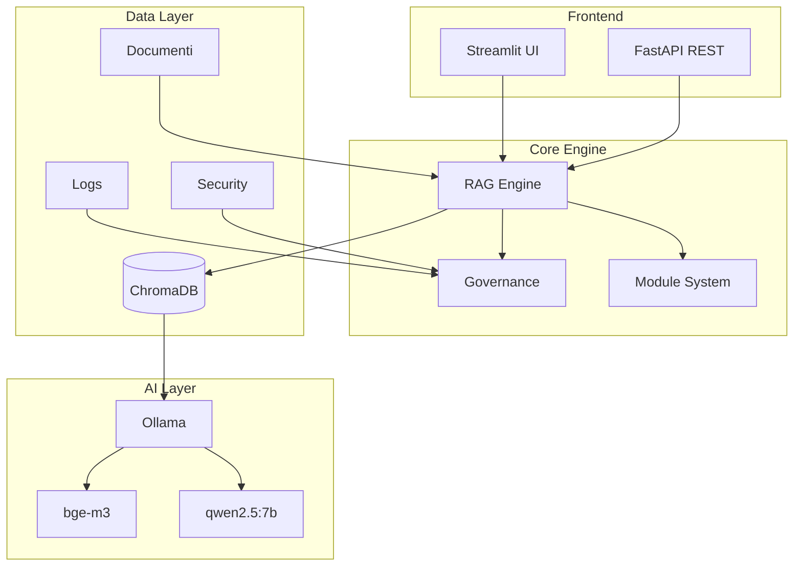
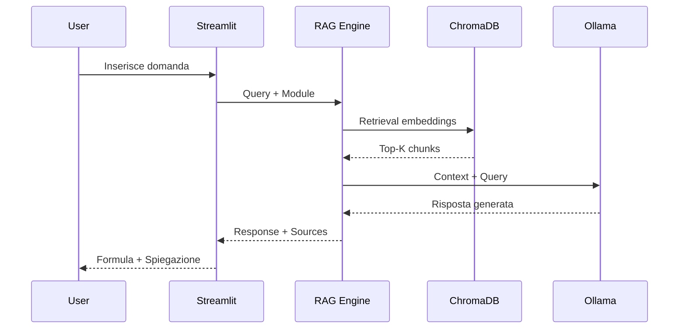
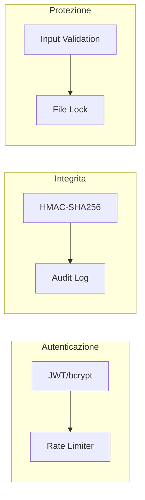

# Ermes - Enterprise Knowledge Hub

Piattaforma RAG aziendale con moduli configurabili per consultare documentazione in linguaggio naturale. Elaborazione
100% locale, nessun dato cloud.

## Quick Start

### Prerequisiti
- Python 3.11+
- Ollama 0.21+ con modelli: `qwen2.5:7b`, `bge-m3`

### Setup

```bash
# 1. Ambiente Python
python -m venv .venv
.venv\Scripts\activate

# 2. Dipendenze
pip install -r requirements.txt

# 3. Configurazione (opzionale)
copy .env.example .env

# 4. Avvia Ollama (terminale separato)
ollama serve

# 5. Avvia app
python -m streamlit run app.py --server.port 8502
```

🌐 **App:** http://localhost:8502  
👤 **Login:** admin / CHANGE_ME

⚠️ Cambia password in `.env` prima di produzione!

## Stack

| Componente | Tecnologia |
|-----------|-----------|
| UI | Streamlit |
| RAG Engine | LlamaIndex |
| Vector DB | ChromaDB (locale) |
| LLM | Ollama (qwen2.5:7b) |
| API | FastAPI |
| Auth | JWT + bcrypt |

## Funzionalita

### Utenti
- Chat RAG su documenti
- Visualizzazione fonti
- Affidabilita risposta
- Export conversazione

### Admin
- Upload documenti (PDF/DOCX/TXT)
- Gestione utenti (viewer/admin)
- Reindicizzazione
- Audit trail

## Configurazione

File `.env` (opzionale):

```env
ERMES_HOST=127.0.0.1
ERMES_PORT=8502
ERMES_ADMIN_USERNAME=admin
ERMES_ADMIN_PASSWORD=CHANGE_ME
OLLAMA_HOST=http://127.0.0.1:11434
ERMES_MODEL=qwen2.5:7b
ERMES_EMBED_MODEL=bge-m3
ERMES_API_KEY=
```

## API REST

Health check:
```bash
curl http://localhost:8503/health
```

Query (richiede `ERMES_API_KEY`):
```bash
curl -X POST -H "Authorization: Bearer KEY" \
  -H "Content-Type: application/json" \
  -d '{"query":"?", "module":"WinSarp"}' \
  http://localhost:8503/query
```

**Nota:** l'API gira sulla porta `8503` (`PORT+1`) se avviata insieme a Streamlit.

## Docker

```bash
docker-compose up -d
```

## Testing

```bash
pytest tests/ -v
```

## Troubleshooting

| Problema | Soluzione |
|----------|-----------|
| Ollama non trovato | ollama.com/download |
| Port in use | Cambia `ERMES_PORT` in `.env` |
| Import error | Attiva venv: `.venv\Scripts\activate` |
| Password sbagliata | Default: admin/CHANGE_ME |

## File Importanti

- `config.py` - Configurazione
- `app.py` - UI Streamlit
- `api.py` - API FastAPI
- `core/rag_engine.py` - RAG engine
- `core/error_handler.py` - Error handling
- `core/input_validator.py` - Validazione input
- `core/governance.py` - Utenti + audit
- `modules/` - Moduli custom

## Security

- Password hashing
- Admin lockout
- Input validation
- Audit trail
- Error handling
- Rate limiting

---

**Versione:** 2.0.0 | **Data:** 25 Maggio 2026 | **Status:** Production Ready

## Architettura

Il progetto implementa l'Opzione 3 dal documento di avvio (LLM Locale):
- 100% locale/on-premise
- Nessun dato esce dalla macchina aziendale
- LLM open-source (Qwen2.5) invece di Claude API
- ChromaDB locale per embeddings
- Integrazioni possibili via API REST

### Diagramma Architettura



### Flusso Query RAG



### Sicurezza


