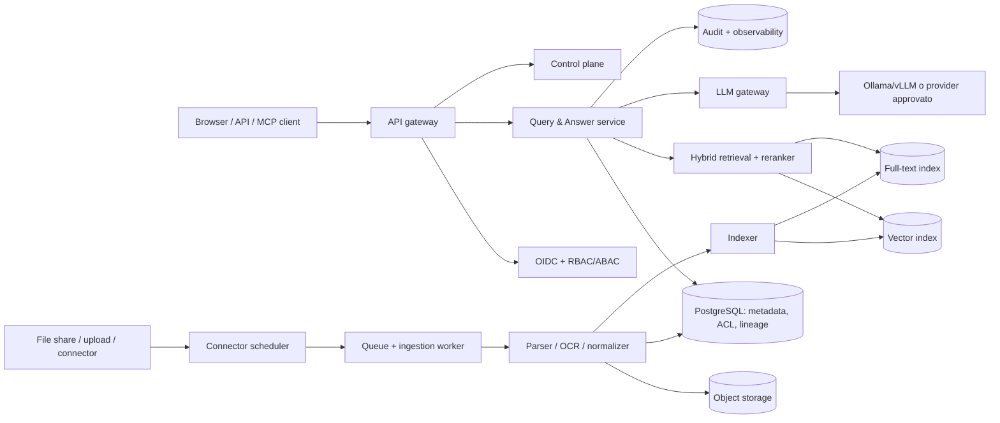

# Architettura target — Ermes Knowledge

Questo documento traduce la strategia prodotto in una architettura incrementale. Non è un impegno a implementare ogni componente nella v0.1.

## Principio architetturale

Separare il **control plane** dal **data plane**. Il primo contiene identità, fonti, policy, configurazione e audit. Il secondo contiene file, parsing, indici, retrieval e inferenza. Il data plane può restare on-premise; qualunque API LLM esterna è un egress esplicito, configurabile e auditato.

## Confini dei moduli

| Modulo | Responsabilità | Non deve fare |
|---|---|---|
| Gateway/BFF | API versionata, streaming, rate limit, request ID | leggere indici senza contesto identità |
| Authorization | OIDC, ruoli/gruppi, decisione policy | lasciare permessi alla sola UI |
| Connector | `discover`, `fetch`, `get_acl`, `checkpoint`, delete | fornire credenziali al parser |
| Ingestion | job idempotenti, retry, dead-letter, tombstone | bloccare richieste utente |
| Parser | type detection, antivirus, OCR, normalizzazione | fidarsi di file non verificati |
| Knowledge registry | documenti/versioni/ACL/provenienza/review | essere sostituito dall'indice vettoriale |
| Retrieval | keyword + vettori + filtri ACL + rerank | produrre output privo di evidenze |
| Answer service | prompt con sole evidence autorizzate, citazioni, astensione | compiere azioni di scrittura in v0.1 |

## Stack iniziale proposto

- **FastAPI** per API e contratti OpenAPI.
- **PostgreSQL** per metadati, ACL, audit e migrazioni.
- **MinIO/S3** per originali e rendition parse; il database non conserva blob.
- **pgvector + PostgreSQL full-text** per MVP semplice, con adapter che permetta Qdrant in seguito.
- **Redis Streams** e worker separato per ingestion; passaggio a RabbitMQ/Kafka solo se richiesto dai volumi.
- **Docling** come parser/OCR predefinito, dietro adapter.
- **Ollama** per sviluppo locale e provider OpenAI-compatible; vLLM/TGI solo per deploy che ne hanno bisogno.
- **Keycloak/OIDC**: non ricostruire un identity provider.
- **OpenTelemetry, Prometheus/Grafana/Loki** per osservabilità.

## Modello dati minimo

Il source of truth è PostgreSQL; l'indice è sempre ricostruibile. Entità chiave:

- `source`, `collection`, `document`, `document_version`, `content_unit`, `chunk`;
- `principal`, `group`, `acl_binding`;
- `sync_run`, `ingestion_job`, `ingestion_error`, `tombstone`;
- `retrieval_run`, `answer_run`, `audit_event`, `review_task`.

`document_version` è immutabile e memorizza hash contenuto, revisione sorgente, MIME type, parser/chunker/embedding profile e chiave storage. Le citazioni contengono sempre `document_id`, `version_id`, locator (pagina, slide, cella o bounding box) ed estratto.

## Regole sicurezza

1. Fail-closed per identità e policy.
2. Doppio controllo ACL: endpoint e filtro nella query di retrieval. `Deny` prevale.
3. File upload: size/type allowlist, magic bytes, antivirus, sandbox senza rete, timeout e quarantena.
4. Segreti solo in runtime secret store; mai in Git, log, backup o artefatti CI.
5. Per collection, policy `local_only` o `approved_provider`, con minimizzazione degli estratti inviati fuori perimetro.
6. Documento trattato come input ostile: separare istruzioni ed evidence; nessun tool/action write nella prima versione.
7. Audit append-only, log privacy-aware, backup cifrati e restore drill.

## Contratti da rendere stabili

- Connector SDK: `discover`, `fetch`, `permissions`, `checkpoint`, `delete`.
- Parser adapter e index adapter intercambiabili.
- OpenAPI versionata e eventi `document.indexed`, `document.failed`, `document.deleted`, `document.review_due`.
- Risposta API: `answer`, `citations`, `retrieval_profile`, `policy_decision`, `abstained` e motivazione.

## Trade-off intenzionali

- Single-tenant prima di SaaS multi-tenant.
- Upload/file system prima di connettori numerosi.
- Retrieval ibrido prima di knowledge graph.
- Citazioni e astensione prima di agenti autonomi.
- pgvector per semplificare MVP; Qdrant/OpenSearch quando scala e filtri lo giustificano.
