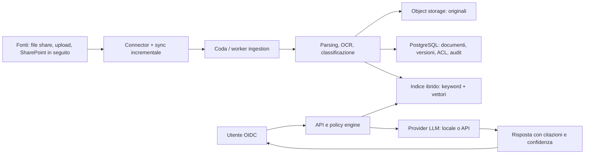

# Ermes Knowledge — strategia di prodotto

**Stato:** proposta di riposizionamento  
**Data:** 30 luglio 2026  
**Nome di lavoro:** Ermes Knowledge

## Decisione di partenza

Ermes non deve diventare un altro prodotto "carica PDF e chatta". Quella categoria è già coperta da piattaforme cloud e self-hosted mature. Il progetto ha senso se diventa una piattaforma **local-first di Knowledge Operations**: rende la conoscenza aziendale ricercabile, verificabile, governata e disponibile agli assistenti AI, senza imporre un unico modello LLM o un unico cloud.

Il motore WinSarp non viene buttato: diventa un esempio di *vertical module* e un banco di prova per il concetto più generale di conoscenza specialistica, validazione e revisione umana.

## Gate zero: contenuti e pubblicazione responsabile

Il progetto è personale e parallelo al lavoro: non c'è un vincolo di titolarità sul codice personale. Prima di pubblicare, va comunque fatta una verifica puntuale degli asset: nessun documento, formula, dato, screenshot, credenziale o know-how riservato eventualmente proveniente da contesti terzi deve entrare nella release pubblica.

La raccomandazione resta un **nuovo repository pulito** o una storia Git ripulita, ma per motivi di qualità del prodotto e posizionamento:

- separare il core generico dagli esempi WinSarp;
- eliminare runtime data, log, segreti, artefatti e documentazione duplicata;
- usare un corpus demo inventato e con licenza esplicita;
- controllare repository e history con secret scanning;
- scegliere e aggiungere una licenza prima della prima release pubblica.

Il repository attuale può quindi essere evoluto o fungere da riferimento tecnico; va solo trasformato in una base coerente e pubblicabile, non pubblicato "as-is".

## Problema che risolviamo

In molte PMI e aziende regolamentate la conoscenza vive in file share, SharePoint, Drive, procedure PDF, Word, Excel e mail. Le persone non sanno:

- quale sia la versione valida di un documento;
- chi ne sia il responsabile e quando vada rivisto;
- se una risposta generata dall'AI sia fondata e autorizzata;
- come usare l'AI senza inviare dati sensibili a servizi non approvati.

Un vector database e una chat non risolvono da soli questi problemi. Il prodotto deve trattare i documenti come asset con provenienza, permessi, stato e ciclo di vita.

## Visione e proposta di valore

> Connetti le fonti aziendali, conserva i permessi e ottieni risposte citate e verificabili. Ermes Knowledge segnala documenti obsoleti, duplicati o in conflitto e consente di usare LLM locali o provider esterni secondo policy.

Il valore vendibile è **fiducia e controllo**, non la generazione di testo:

1. **Evidence-first.** Ogni risposta importante indica documento, versione, pagina/estratto e confidenza; se le prove non bastano, l'assistente dichiara di non sapere.
2. **Permission-aware.** L'utente vede solo i contenuti che può leggere nella sorgente; il controllo avviene prima e durante il retrieval, non soltanto nell'interfaccia.
3. **Local-first, model-agnostic.** L'azienda può usare Ollama/vLLM nel proprio perimetro o abilitare API esterne per specifici workspace, dati o policy.
4. **Knowledge lifecycle.** Owner, revisione, scadenza, versioni, retention, sospensione e approvazione rendono utilizzabile nel tempo la knowledge base.
5. **Operabile dall'IT.** Deploy riproducibile, backup/restore provato, osservabilità, controllo costi, audit e integrazione con identità aziendale.

## Cliente iniziale e casi d'uso

Il prodotto non parte orizzontale. Il primo segmento da validare è: **PMI italiane/UE con documentazione riservata e procedure operative**, in particolare qualità/ISO, HR, sicurezza, manuali tecnici e operations.

| Ruolo | Lavoro da svolgere | Risultato atteso |
|---|---|---|
| Utente operativo | Trovare una procedura o una risposta | Risposta con fonte, non una supposizione |
| Knowledge owner | Mantenere valida la documentazione | Scadenze, versioni, conflitti e review |
| IT/security | Rendere disponibile l'AI in sicurezza | Policy dati, audit, permessi e deployment |
| Consulente/SI | Configurare un ambiente per il cliente | Installazione ripetibile, template e connettori |

WinSarp resta un template verticale: "Formula Knowledge Studio", con catalogo, validazione e approvazione. Non deve condizionare il core generico.

## Posizionamento: cosa siamo e cosa non siamo

| Siamo | Non siamo |
|---|---|
| Control plane della conoscenza privata | Un chatbot generalista |
| Ricerca + governance + provenienza | Un semplice wrapper API per LLM |
| Base locale, estendibile con cloud | Un document management system completo |
| Piattaforma per team IT e knowledge owner | Un agente autonomo che modifica documenti in v0.1 |

I riferimenti competitivi mostrano che la ricerca enterprise è una categoria reale ma affollata: [Glean](https://www.glean.com/enterprise-search), [Microsoft 365 Copilot connectors](https://learn.microsoft.com/en-us/microsoft-365/copilot/connectors/), [Onyx](https://github.com/onyx-dot-app/onyx), [RAGFlow](https://github.com/infiniflow/ragflow) e [AnythingLLM](https://github.com/Mintplex-Labs/anything-llm). Il differenziale dichiarato deve quindi essere governance/lifecycle/provenance locale, oppure una verticale precisa.

## Scope v0.1 — una demo completa, non una promessa enterprise

### Decisione di scope

La prima release è un **bibliotecario aziendale funzionante per PMI**, non una piattaforma enterprise completa. Il suo lavoro è semplice: ricevere documenti, conservarne contesto e versione, permettere una ricerca affidabile e rispondere con fonti.

La generazione e la validazione di formule WinSarp non fanno parte dell'esperienza v0.1. Il codice eventualmente riutilizzabile resta isolato come modulo sperimentale/non esposto, per un futuro vertical pack.

La v0.1 deve avere un percorso utente intero e dimostrabile:

1. un amministratore crea una biblioteca/collection e carica documenti o collega una cartella locale;
2. un worker estrae testo e metadati, conserva originale e versione;
3. l'utente autorizzato cerca o chiede; riceve risposta, citazioni e link all'estratto;
4. l'amministratore vede import riusciti/falliti e può reindicizzare;
5. l'istanza usa un modello locale oppure un provider compatibile OpenAI configurato via secret.

### Funzionalità incluse

- PDF, DOCX, XLSX, Markdown e testo; OCR come job esplicito, non prerequisito;
- storage originale + metadati/versioni; hash e deduplica di base;
- ricerca keyword + semantica, con filtri per biblioteca e metadati;
- chat/read-only con citazioni obbligatorie, pagina/estratto e apertura del file sorgente;
- ruoli iniziali `admin` e `member`, con biblioteche private o condivise;
- provider adapter Ollama e OpenAI-compatible; il provider esterno è disabilitato finché non configurato;
- import/reindex come job visibili, log essenziali e backup documentato;
- Docker Compose, corpus demo sintetico, golden set di valutazione e CI.

### Fuori scope deliberatamente

- modifiche autonome ai file sorgente;
- decine di connettori e sincronizzazione universale;
- SSO/SCIM, sync avanzato dei gruppi e multi-tenancy SaaS;
- OCR avanzato, knowledge graph e classificazione automatica costruiti "per moda";
- promesse di conformità GDPR/ISO senza analisi legale e controlli verificati;
- agenti con accesso di scrittura a Slack, mail, ERP o filesystem.

## Architettura target

### Componenti: riuso contro sviluppo proprietario

| Area | Scelta proposta | Perché |
|---|---|---|
| API | FastAPI, ripulito in application/domain/adapters | riusa competenze e parti sane del repo |
| Parsing | Docling o Unstructured, dietro interfaccia | parsing/OCR non è il vantaggio competitivo |
| Metadati/ACL | PostgreSQL | transazioni, query, audit e migrazioni affidabili |
| File originali | MinIO/S3 | versioni e backup separati dagli indici |
| Ricerca | Qdrant + keyword engine, oppure OpenSearch | retrieval ibrido e filtri ACL; evitare dipendenza da solo Chroma |
| LLM gateway | adapter propri o LiteLLM | provider locali/cloud intercambiabili e policy centrali |
| Identità | OIDC/Keycloak per sviluppo, integrazione IdP in produzione | non implementare login enterprise da zero |
| Job | coda + worker separati | l'ingestion e OCR non devono bloccare l'API |

Il cuore che costruiamo noi è il modello canonico `Document → Version → Chunk → Provenance → ACL → Lifecycle`, più le policy e la UX evidence-first.

## Sicurezza come requisito di prodotto

La precedente revisione del repository ha trovato bypass di autenticazione, backup con `.env` e altri rischi. Non devono migrare nel nuovo core. Le regole non negoziabili sono:

- autenticazione fail-closed e autorizzazione a ogni query/job;
- ACL copiate dalla sorgente e applicate ai risultati; test di regressione "cosa può vedere Mario?";
- segreti in secret store o variabili runtime, mai nel repository, log o backup in chiaro;
- file caricati in quarantena, limiti streaming, allowlist tipi, scanning e approvazione prima dell'indicizzazione;
- cifratura in transito; cifratura a riposo e gestione chiavi valutate per l'ambiente target;
- audit append-only, retention configurabile e export SIEM;
- threat model e `SECURITY.md` pubblicati.

## Roadmap proposta

| Fase | Durata indicativa | Deliverable e criterio di uscita |
|---|---:|---|
| 0. Decisione e pulizia | 1–2 settimane | nuovo brand/repo o ramo pulito, ADR, dati sintetici, rimozione segreti e artefatti interni |
| 1. Foundation | 2 settimane | app factory, Postgres, storage, identity mock/OIDC, Compose, CI bloccante |
| 2. Ingestion e search | 3 settimane | upload/watch folder, parsing async, versioni, ricerca ibrida, citazioni e test end-to-end |
| 3. Governance | 2–3 settimane | ACL collection, policy provider, audit, lifecycle, dashboard job e backup/restore testato |
| 4. Demo e validazione | 1–2 settimane | demo corpus, evaluation-as-code, video, documentazione, feedback di 3–5 utenti |
| 5. Primo connector | dopo validazione | SharePoint, Nextcloud o Google Drive scelto con un design partner; sync e permission mapping |

Le durate non sono impegni commerciali: servono a tenere lo scope sotto controllo. Il primo obiettivo è una v0.1 in 8–12 settimane che una persona possa installare e provare.

## Metriche che contano

Non misurare solo il numero di chat. Misurare:

- percentuale di risposte con citazione corretta;
- recall dei documenti corretti nel top-k;
- percentuale di risposte che rispettano ACL;
- latenza p50/p95 e costo per risposta/provider;
- successo e durata di ingestion, duplicati e documenti obsoleti;
- tasso di feedback utile e tempo medio per trovare una procedura;
- restore riuscito e verificato.

Ogni release deve avere un golden set versionato e una soglia esplicita; mai dichiarare "accuratezza" usando soltanto test sintetici favorevoli.

## Strategia GitHub e portfolio

Il repository deve essere un esempio di prodotto serio, non un accumulo di feature:

- `README` con problema, screenshot/GIF, quick start e limiti dichiarati;
- `docs/architecture.md`, ADR, API OpenAPI, threat model e security policy;
- demo data fittizia, nessun PDF o segreto aziendale reale;
- test unitari, integrazione, e2e e evaluation; SAST, dependency scan, SBOM e immagini pinning;
- `CONTRIBUTING.md`, code of conduct, issue template e roadmap;
- licenza permissiva da decidere prima della pubblicazione (MIT/Apache-2.0), dopo verifica di tutte le dipendenze.

WinSarp può vivere in `examples/winsarp` con dati inventati o autorizzati; non deve essere richiesto per avviare Ermes Knowledge.

## Modello commerciale da esplorare

Non decidere troppo presto. Tre ipotesi da validare con interviste:

1. **Deploy + supporto per PMI:** fee di setup, canone per ambiente e supporto.
2. **Canale consulenti/SI:** template verticali, connettori e deployment ripetibile per più clienti.
3. **Edizione enterprise:** on-prem/private cloud, SSO, connector permissions, audit/export e SLA.

La versione GitHub serve ad acquisire fiducia e feedback; non deve fingere di essere già una SaaS enterprise completa.

## Decisioni da prendere prima di scrivere il nuovo codice

1. Quale primo settore/caso d'uso vogliamo validare?
2. Scegliamo un nuovo repository pulito o una migrazione incrementale di questo?
3. Quale fonte iniziale: filesystem locale, SharePoint, Nextcloud o Drive?
4. Che livello di apertura vogliamo: open source completo, open-core, o portfolio pubblico senza prodotto commerciale immediato?
5. Abbiamo 3–5 persone/aziende disponibili a provare il problema, non solo a vedere una demo?

Finché queste risposte non ci sono, evitare di aggiungere connettori, agenti o feature AI. La prossima attività è una fase breve di discovery con utenti reali e una specifica v0.1 firmata.
