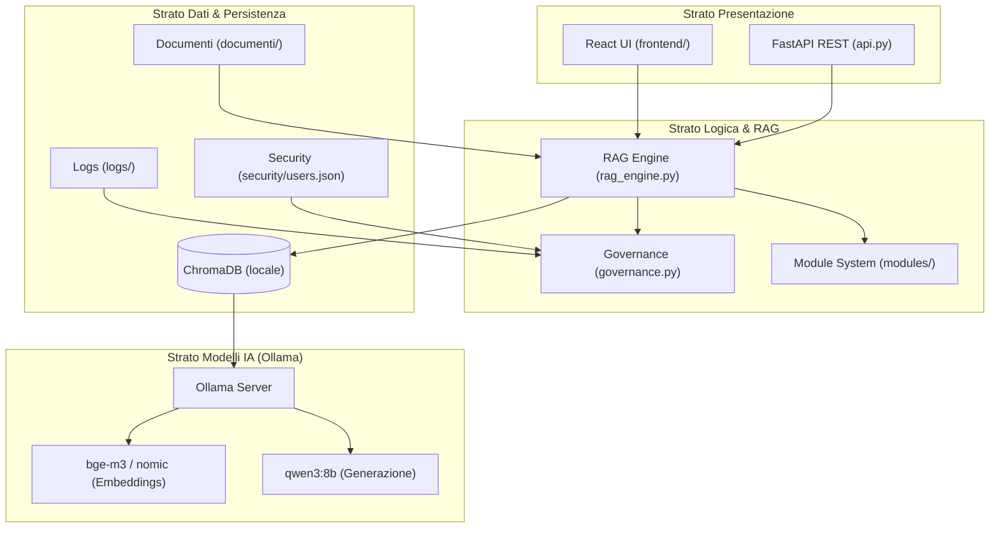

# Analisi Tecnica Dettagliata del Progetto: Ermes - Enterprise Knowledge Hub

Ermes è un sistema **RAG (Retrieval-Augmented Generation)** aziendale progettato per l'elaborazione di documentazione e la consultazione/generazione di formule in linguaggio naturale. La caratteristica fondamentale del sistema è il funzionamento **100% locale ed offline**, per garantire la massima riservatezza dei dati aziendali, evitando che informazioni sensibili escano dal perimetro dell'infrastruttura locale.

---

## 🗺️ Architettura Generale del Sistema

Il progetto è strutturato su più livelli, separando nettamente la presentazione (UI), lo strato applicativo (motore RAG e API), lo strato di sicurezza/governance e lo strato dati.

---

## 🗂️ Struttura delle Directory e Moduli Codice

I file principali del progetto sono descritti di seguito:

### ⚙️ Configurazione e Avvio
*   [config.py](file:///c:/ProgettoRAG_DEV/config.py): Gestione centralizzata dei parametri ambientali. Consente l'override tramite variabili d'ambiente o file `.env`. Controlla le porte, le directory per i dati, i timeout di generazione, i modelli utilizzati (`ERMES_MODEL` di default impostato a `qwen3:8b` e `ERMES_EMBED_MODEL` a `bge-m3`), le soglie di confidenza del RAG e le chiavi API.
*   [scripts/AVVIA.bat](file:///c:/ProgettoRAG_DEV/scripts/AVVIA.bat) e [AVVIA_PRO.bat](file:///c:/ProgettoRAG_DEV/AVVIA_PRO.bat): Script di avvio per l'ambiente Windows. Verificano i prerequisiti (Python, Ollama) e lanciano in background il server Ollama e il backend FastAPI su http://localhost:8504.
*   [docker-compose.yml](file:///c:/ProgettoRAG_DEV/docker-compose.yml) e [Dockerfile](file:///c:/ProgettoRAG_DEV/Dockerfile): Supporto per containerizzazione opzionale.

### 🧠 Core RAG e Intelligenza Artificiale
*   [rag_engine.py](file:///c:/ProgettoRAG_DEV/rag_engine.py): Inizializza i parametri di LlamaIndex. Gestisce la connessione con l'host locale Ollama, coordina il database vettoriale ChromaDB e implementa la logica di indicizzazione ed estrazione.
    *   **Indicizzazione basata su Hash:** L'indicizzazione avviene in modo incrementale o pigro. Calcola l'hash della cartella dei documenti ([compute_dir_hash](file:///c:/ProgettoRAG_DEV/utils.py)) e, se coincide con quello memorizzato in `docs_hashes.json`, carica l'indice senza reindicizzare, velocizzando drasticamente i tempi di caricamento.
    *   **MarkdownNodeParser:** Usa il parser markdown per suddividere i documenti, ideale per documenti tecnici in cui ogni formula o capitolo è strutturato con intestazioni markdown.
    *   **Locking del Vector DB:** Implementa un file lock globale (`.chroma_lock`) tramite la libreria `filelock` per prevenire conflitti di scrittura concorrente su ChromaDB.

### 🛡️ Sicurezza, Governance e Input Validation
*   [governance.py](file:///c:/ProgettoRAG_DEV/governance.py): Gestisce il login degli amministratori e degli utenti.
    *   **Hashing sicuro:** Le password sono protette con hashing **PBKDF2-HMAC-SHA256** combinato con un `salt` univoco per ciascun utente e 120.000 iterazioni.
    *   **Timing-Safe Comparison:** L'autenticazione usa `hmac.compare_digest` per prevenire i timing attacks. Anche in caso di username inesistente, esegue un hashing "fittizio" per evitare l'enumerazione degli utenti basata sul tempo di risposta.
    *   **Audit Trail firmato con HMAC:** Ogni azione critica degli amministratori (es. caricamento file, aggiornamento DB) viene registrata nel file `logs/audit_admin.jsonl` con un timestamp e una **firma HMAC-SHA256** crittografata con una chiave segreta di sistema. Qualsiasi tentativo di manipolazione manuale del log viene rilevato immediatamente dalla funzione [verify_audit_log_integrity](file:///c:/ProgettoRAG_DEV/governance.py#L292).
*   [input_validator.py](file:///c:/ProgettoRAG_DEV/input_validator.py): Controlli preventivi contro tentativi di attacco (Path Traversal, Null Byte Injection). Imposta limiti severi sulle lunghezze degli username, dei nomi dei moduli e delle query degli utenti.
*   [rate_limiter.py](file:///c:/ProgettoRAG_DEV/rate_limiter.py): Implementa un rate limiter in-memory per IP o identificativo sessione. Previene abusi o attacchi DOS limitando il numero di query al minuto (max 60/min) e le dimensioni totali degli upload orari (max 500MB/ora o max 20 caricamenti/ora).

### 🖥️ Interfaccia Utente (React SPA)
L'UI è una Single Page Application React con Vite, servita staticamente dal backend FastAPI:
*   [frontend/](file:///c:/ProgettoRAG_DEV/frontend/): SPA React buildata in `frontend/dist/`.
*   **API backend**: Il frontend comunica con il backend via REST API su `localhost:8502`.

### 📊 Dashboard & Monitoring KPI
*   [monitor_dashboard.py](file:///c:/ProgettoRAG_DEV/monitor_dashboard.py): Analizza in tempo reale i log delle sessioni per estrarre statistiche aggregate:
    *   **Utilizzo:** Sessioni totali/giornaliere/settimanali e query per modulo.
    *   **Performance:** Tempo medio di risposta dell'LLM (min/avg/max) in secondi.
    *   **Stato Infrastruttura:** Spazio occupato su disco, file indicizzati per modulo, numero di utenti attivi e amministratori.
    *   **Feedback:** Calcolo della percentuale di risposte giudicate utili (Up) e non utili (Down).
    *   Esporta il report completo su file JSON (`logs/dashboard_report.json`) scaricabile direttamente dall'interfaccia.

### 🔌 REST API (FastAPI)
*   [api.py](file:///c:/ProgettoRAG_DEV/api.py): Espone un server FastAPI (porta `8502`) che consente l'integrazione di Ermes all'interno di chatbot aziendali (Teams/Slack) o altri portali intranet, e serve anche il frontend React precompilato.
    *   **Autenticazione via Bearer Token:** Richiega una chiave `ERMES_API_KEY` forte (se vuota, le API restano disabilitate per sicurezza). La convalida della chiave avviene tramite `hmac.compare_digest`.
    *   **Endpoint `/health`:** Fornisce un resoconto completo dello stato di salute per sistemi di monitoraggio esterni (funzionamento effettivo di ChromaDB, spazio libero sul disco in GB, disponibilità di Ollama e dei modelli).
    *   **Endpoint `/query`:** Accetta una query in linguaggio naturale e restituisce la risposta dell'LLM, il livello e il punteggio di confidenza numerico, i chunk di contesto usati per il retrieval (con relativi score e file sorgente) e i secondi impiegati per completare la richiesta. Offre inoltre il parametro booleano `formula_only` per restituire esclusivamente il codice compresso delle formule escludendo le spiegazioni testuali.

---

## 🧩 Il Sistema a Moduli Extensibili

Ermes adotta un pattern a plugin per la gestione di domini informativi differenti.
1.  [modules/base.py](file:///c:/ProgettoRAG_DEV/modules/base.py): Definisce l'interfaccia astratta `BaseModule` che richiede l'implementazione dei metodi `get_system_prompt()`, `parse_response()`, `validate_content()` e `is_applicable()`.
2.  [modules/generic.py](file:///c:/ProgettoRAG_DEV/modules/generic.py): Modulo di fallback generico. Utilizzato quando i documenti caricati in una cartella non richiedono trattamenti sintattici o validazioni particolari.

### 📐 Modulo Specializzato: WinSarp

Il modulo [modules/winsarp.py](file:///c:/ProgettoRAG_DEV/modules/winsarp.py) è il più complesso e avanzato del sistema. È dedicato all'elaborazione delle formule di calcolo orario aziendali (WinSarp) ed esegue un controllo rigidissimo sul codice:

#### 1. Validazione Sintattica
La funzione [validate_winsarp](file:///c:/ProgettoRAG_DEV/modules/winsarp.py#L249) verifica:
*   La corretta terminazione con il carattere `;`.
*   Il bilanciamento perfetto di parentesi graffe `{}`, tonde `()` e apici (singoli `'` e doppi `"`).
*   L'assenza di riferimenti a campi vietati o protetti (es. registri speciali, campi `7-9`, `10-19`, `60-69`, `90-99` o `79`).
*   Il reset obbligatorio dei campi temporanei (registri di appoggio `71-78`) prima di utilizzare l'assegnazione multipla `(70=...)`.
*   L'utilizzo degli operatori orari corretti (`A` per addizione e `S` per sottrazione) anziché i normali operatori matematici `+`/`-` su campi sessagesimali.
*   La presenza della gestione della mezzanotte (`{83}<{82}({83}A'1440'={83});`) qualora vengano calcolati intervalli temporali.

#### 2. Validazione Semantica
Verifica che i campi assegnati corrispondano al loro significato logico tramite una mappa semantica (`_FIELD_SEMANTIC_MAP`):
*   Se un utente tenta di assegnare la stringa `"DURATA"` a un campo delegato allo straordinario (es. `561`), la funzione [_validate_semantic_coherence](file:///c:/ProgettoRAG_DEV/modules/winsarp.py#L402) solleva un errore semantico e suggerisce il campo corretto (es. `500`).
*   Rileva l'uso di costanti a 4 cifre (che sembrano orari) in campi non orari.

#### 3. Auto-correzione (Auto-Fix)
La funzione [auto_fix_formula](file:///c:/ProgettoRAG_DEV/modules/winsarp.py#L493) corregge in modo autonomo gli errori di distrazione più frequenti restituiti dai modelli linguistici:
*   Aggiunge il `;` mancante in fondo alla riga.
*   Chiude le parentesi o gli apici sbilanciati alla fine della formula.
*   Sostituisce i campi errati con quelli corretti in base all'analisi semantica.
*   Elimina gli spazi vuoti superflui.

#### 4. Doppia Modalità Operativa (Retrieval vs Generazione)
*   **📖 Consulta Catalogo (Retrieval):** Il prompt di sistema (`PROMPT_WINSARP`) forza l'LLM a recuperare la formula **esattamente** come compare nei documenti ufficiali. Se la formula non esiste, l'LLM risponde con la frase canonica: *"Nel catalogo non e' presente una formula per questo caso"*. app.py intercetta questa risposta o rileva una confidenza del DB vettoriale inferiore a `0.60`, segnalando chiaramente all'utente la mancata corrispondenza ed evitando allucinazioni.
*   **✨ Generatore Formule (Generazione):** Se abilitata via config, sblocca una modalità in cui l'LLM viene istruito con la grammatica completa della sintassi WinSarp (`PROMPT_WINSARP_GENERAZIONE`) per creare da zero nuove formule complesse. Le formule generate vengono sottoposte alla validazione sintattica/semantica in tempo reale ed è integrato un flusso di approvazione per consentire all'utente di convalidare, modificare o rigenerare la proposta.

---

## 🔬 Suite di Testing

Il sistema è coperto da test automatizzati localizzati nella cartella `tests/`:
*   `test_winsarp.py`: Testa l'auto-correzione sintattica, la rimozione dei commenti e il rilevamento degli errori sintattici su formule reali.
*   `test_rate_limiter.py`: Verifica che le richieste e i file caricati vengano bloccati correttamente al superamento delle soglie impostate.
*   `test_governance.py`: Convalida la firma digitale HMAC dell'audit log e verifica il corretto comportamento in caso di tentativi di manomissione.
*   `test_api.py`: Testa gli endpoint REST, assicurandosi che le query non autorizzate siano bloccate e che la chiave Bearer venga verificata in modo sicuro.
*   `test_quality.py`: Esegue test sulla qualità di retrieval RAG e risposte del modello.

---

## 📈 Punti di Forza e Raccomandazioni di Sicurezza

### 👍 Punti di Forza
1.  **Architettura 100% Locale:** Totale conformità GDPR e sicurezza aziendale.
2.  **Robustezza di Validazione:** La combinazione di controlli regex e semantici per WinSarp impedisce l'introduzione di errori di sintassi nei sistemi ERP aziendali.
3.  **Governance Completa:** Log delle attività amministrative cifrato contro le modifiche non autorizzate.
4.  **Performance Ottimizzate:** L'uso combinato di caching degli indici LlamaIndex, hash dei file e database Chroma locale riduce drasticamente l'overhead computazionale del server.

### 🔒 Raccomandazioni per la Produzione
1.  **Password di Default:** Modificare assolutamente la variabile `ERMES_ADMIN_PASSWORD` (attualmente impostata a `CHANGE_ME` o vuota) e usare una password complessa (conforme ai requisiti di [validate_password_strength](file:///c:/ProgettoRAG_DEV/governance.py#L189)).
2.  **API Key REST:** Assicurarsi che `ERMES_API_KEY` sia popolata con una stringa generata crittograficamente (es. `secrets.token_urlsafe(32)`) prima di esporre la porta 8502.
3.  **Segreto per l'Audit:** Impostare la variabile d'ambiente `ERMES_AUDIT_SECRET` in modo statico sul server di produzione per evitare che la chiave HMAC cambi ad ogni riavvio dell'applicazione.
